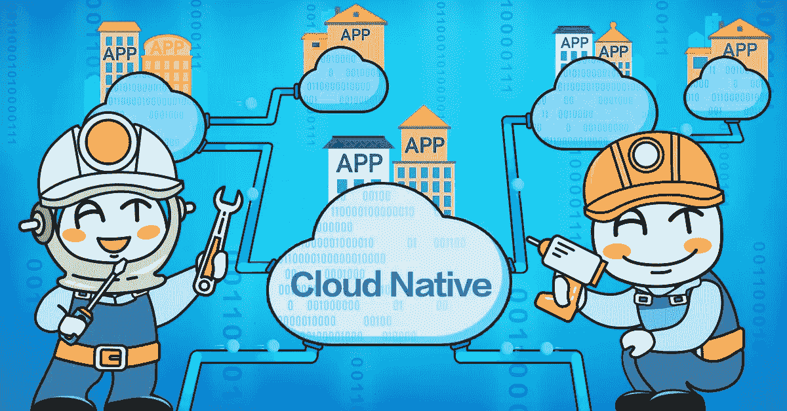
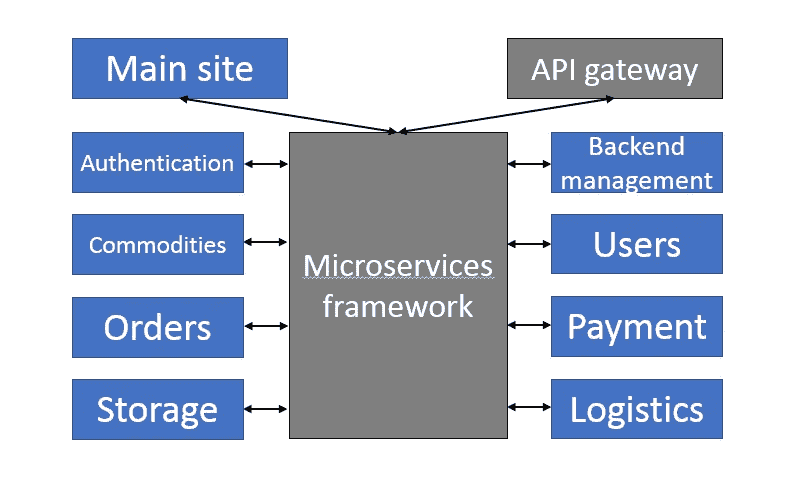
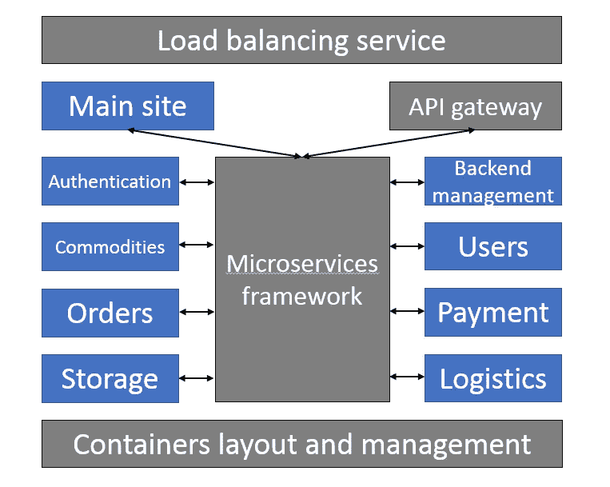
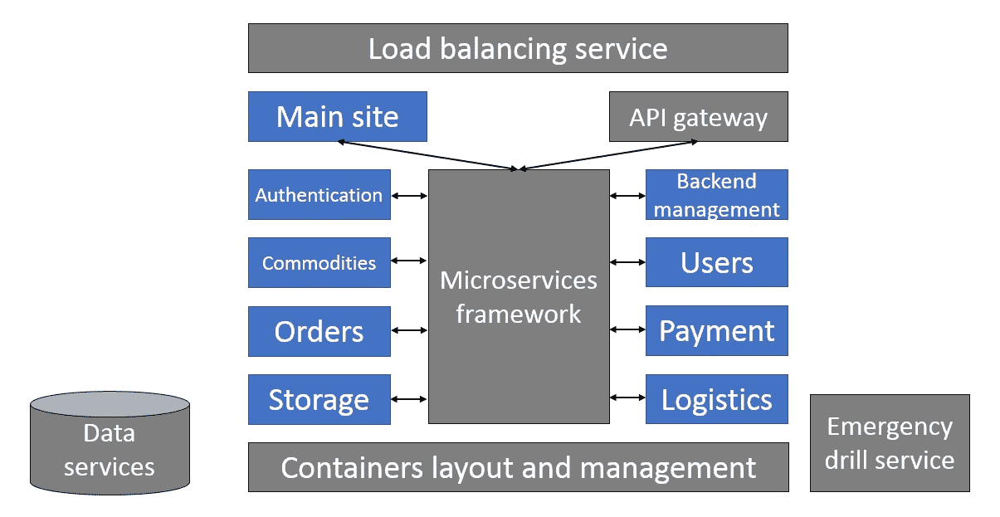
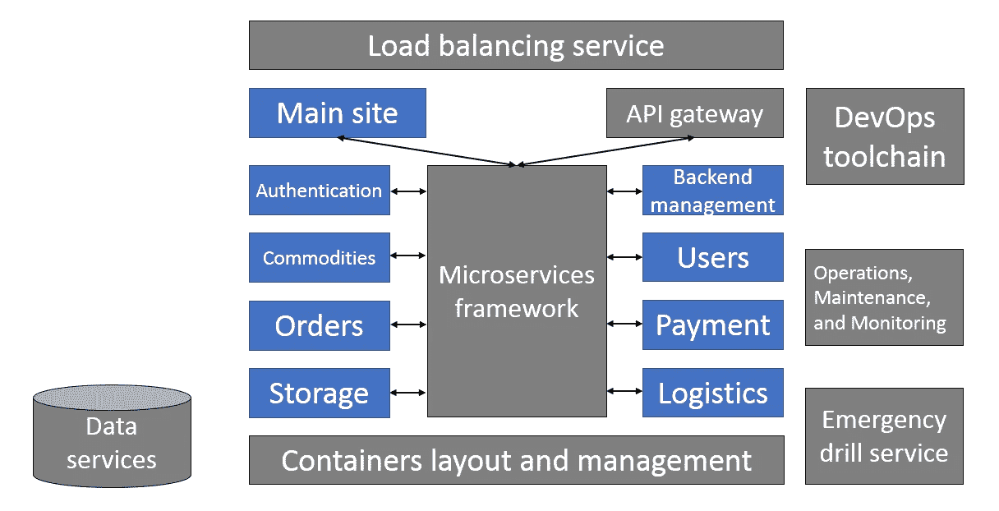
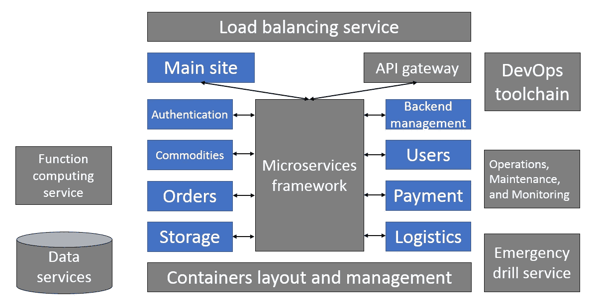

# 编写极高的应用程序:云本地开发指南

> 原文：<https://medium.com/hackernoon/writing-sky-high-applications-a-guide-to-cloud-native-development-9f3c1c020471>

## *阿里巴巴技术团队在云时代构建灵活、可扩展应用的最佳实践*

应用程序开发的云原生时代已经到来，随之而来的是开发人员面临的越来越多的机遇和挑战。云原生技术旨在实现松散耦合、弹性、可管理和可观察的系统，它从根本上改变了应用程序的构建和运行方式，从而提高了基于云的新环境的可扩展性。

根据阿里巴巴开发人员的见解，本文探讨了云原生开发人员在编写这些高度自治的应用程序时应该遵守的关键实践，从确保弹性可伸缩性和容错到增强管理和观察的易用性。

# 塑造云原生应用

云原生开发的第一步是为应用程序提供所需的形状。传统的应用程序通常类似于雪球，不断积累功能，同时变得越来越笨重和难以修改，并随着它们的发展而与它们所支持的业务脱节。相比之下，云原生开发的主要目标之一是实现快速迭代、试错和业务创新。为此，开发人员必须首先用微服务中的架构概念定义他们的应用程序结构。

## 应用分解

要确保整个应用系统的敏捷性，需要将应用分解为多个独立的部分，这些部分可以独立实现、通过演化来推动和扩展，即微服务。

在微服务之间进行划分是一门艺术，一般原则是根据它们的业务领域进行划分。这可以在精细或粗糙的粒度级别上完成。一般方法是确定可由微服务单独实施的主要业务组件，如以下在线商店示例所示，该示例分为商品、用户、支付和库存等组件:

## 应用开发

确定了适当的划分后，下一个逻辑步骤是定义和实现每个微服务。

定义微服务最重要的部分是定义它的 API，可以是 HTTP 协议 API、REST 风格的 API 或基于 RPC 的 API。HTTP 方法的优点是 HTTP 协议被广泛接受(具有成熟和完整的标准，支持所有编程语言，以及健全的编程框架和生态系统),并且它在网络基础设施中无处不在，具有全套支持功能，如负载平衡、防火墙和缓存优化。就缺点而言，HTTP 方法具有更高级别的封装，这会导致开销增加和性能降低。虽然像 Thrift 和 Dubbo 协议这样的 RPC 方法具有更好的性能和延迟，但是尽管它们能够实现跨语言操作，但是它们并没有被广泛接受。作为上述方法的折衷，gRPC 基于 HTTP 2.0。

在过去，选择特定的协议对后续选择使用哪个微服务调用框架有很大的影响。例如，使用 HTTP 方法，使用网飞开源组件作为微服务的调用框架是有意义的，包括 Eureka、Ribbon、Zuul 等等。鉴于 Spring 很好地集成了这些网飞组件，并融合到其 Spring Boot 系统中，Spring 为 Java 开发人员做出了一个很好的选择。使用 RPC 方法，Dubbo 的完整操作和管理系统将是一个很好的选择，它对多种语言的支持在过去几年中一直在逐步改进。

今天，服务网格技术的出现使微服务的数据平面和管理平面明确解耦，允许多协议支持和各种管理能力更容易插入。更重要的是，sidecar 方法使应用程序能够独立于微服务管理系统运行，大大减少了它对应用程序的干扰。Istio 是一个流行的服务网格实现，支持 HTTP、gRPC 和 TCP 等协议。Dubbo 协议支持也正在增加。

微服务 API 主要用于内部交互，即单个微服务之间的交互。作为原生云应用，它还需要一个外部公共 API，以便与云上的其他应用和各种终端设备灵活通信。这一层的 API 通常通过 API 网关进行管理和公开，API 网关与后端微服务的 API 进行对话。API 网关可以支持简单的编排，并支持访问控制、流量控制、计量和分析。

## 应用程序部署和管理

第三步涉及应用程序的部署和管理。容器无疑是云原生应用程序的理想打包和部署工具，其最大优势是可移植性。这不仅使开发和部署环境更加一致，还允许应用程序更容易地在不同供应商的私有云和公共云之间迁移。

每个微服务都可以打包到一个或多个容器中进行部署。尽管可以使用 Docker 等原子工具进行部署，但使用 Kubernetes 等容器编排工具来部署和管理这些容器可以省去很多麻烦，因为云原生应用程序往往具有大量容器。同时，Kubernetes 还通过 Secrets 和 ConfigMaps 支持配置外部化，这是 cloud native 遵循不可变应用程序原则的最佳实践之一。

主流云厂商提供无服务器的 Kubernetes 服务，使用该服务，用户不需要管理容器运行所需的底层计算节点，而是可以根据 Kubernetes 规范描述应用程序，然后在一个命令或点击中进行部署；此外，资源按需调配，这也提升了云原生开发的体验。

Cloud Foundry 采用了一种更激进的方法，旨在为开发者提供纯粹的以应用为中心的体验。只要推送代码，Cloud Foundry 就会调用相应的 buildback 对应用进行打包，最终以容器的形式进行部署。这种方法更适合具有简单拓扑和相互依赖关系的应用程序，尤其是 web 应用程序。

一切都是有代价的，虽然 Cloud Foundry 为开发人员提供了更大的便利，但也限制了他们对应用环境和底层管理的控制。OpenShift 试图为 Kubernetes 系统引入类似的部署体验，同时保留开发者对 Kubernetes 层的控制权，但其更广泛的生态系统目前仍相对单调。

# 将灵魂融入云原生应用

随着其形状的建立，开发人员的下一步是赋予云原生应用程序其“灵魂”，或独特的特征。这需要一系列复杂的过程，从可伸缩性到对频繁变化的支持。

## 弹性可扩展性

为应用程序提供可伸缩性需要一系列的三个步骤，首先是确保应用程序逻辑本身的横向扩展能力；这形成了一个关键的基础，因为每个微服务的应用逻辑可以通过旋转更多的实例来实现更强大的处理能力。一个重要的实践是将应用程序数据和状态外部化，这可以由公共云上的一系列现成云服务来支持，例如将数据放入 RDS 或 NoSQL 服务，将状态放入 Redis 服务。有了这个基础，就有可能进一步实现自动伸缩，也就是说，应用程序可以根据负载自动伸缩。Kubernetes 提供了自动伸缩能力，从而使应用程序的每个微服务能够独立伸缩。

第二步是保证应用管理能力，使得前端接入层的负载均衡规则和微服务之间的调用路由能够实时更新，以反映每个微服务实例的来去。这通常是通过云供应商提供的负载平衡服务和微服务调用框架来实现的。

第三步是确保应用程序所依赖的云服务的可伸缩性。云服务需要能够适应应用规模的变化。对于无状态应用程序，数据层经常成为瓶颈，因此拥有可伸缩的数据服务至关重要。如果云服务不能提供透明的可伸缩性，应用程序的可伸缩性就无从谈起。像 AWS 的 Aurora 和阿里云的 POLARDB 这样的云原生数据库提供了高扩展性，是面向未来的应用程序的最佳选择。

然而，根据应用程序支持的业务特征选择适当的事务模型也很重要。传统上，开发人员已经习惯于将所有数据存储在关系数据库中，并使用 ACID 事务模型，这对于编程来说很简单，但牺牲了性能和可伸缩性。在云原生应用中，NoSQL 数据库和基本事务策略提供了另一种选择。它们可用于管理非事务性数据，如用户评论、标签等，以提高性能和可伸缩性。

## 容错

与弹性可伸缩性一样，赋予应用程序容错的质量涉及多个层面的工作。

第一个问题涉及多 AZ，甚至多区域灾难恢复部署和备份，从宏观角度来看，这一直是云原生应用程序的最佳实践。这样，就有可能确保当某个 AZ 甚至整个区域出现系统故障时，应用程序仍能继续提供服务。

下一步是确保在应用程序的微服务或外部依赖性出现故障时所需的容错和服务降级能力。网飞在这一领域获得了显著的经验，其开源的 Hystrix 实现了强大的断路和降级能力。

第三步必须解决一些微服务实例不可避免的故障，这意味着它们的工作必须被其他实例取代。无状态提供了确保这一点的重要手段，但是负载平衡服务和微服务调用框架需要能够立即更新路由。Kubernetes 等管理平台可以创建新的实例来替换失败的实例。

俗话说，避免失败的最好方法是经常失败。网飞倡导的“混沌工程”有着宝贵的影响，挑战团队在问题出现时处理问题的创造力。为此，主动失败可以帮助团队发现系统中的弱点并验证容错能力，从而增强应用程序。

## 易于管理和观察

让应用程序具有对观察和管理开放的品质需要使用适当的工具和平台。例如，Kubernetes、Dubbo 和 Istio 提供了许多方便的管理功能，后两者能够显示微服务运行状况的多个指标。AIOps 最近成为一种流行趋势。但在我们谈论智能之前，对应用程序状态的可见性和自动化(根据状态自动执行特定操作)是管理的基础；只有当这两个做到了足够的程度，收集了足够的数据，才能形成对数据的智能理解。

## 支持频繁变更

自动化的持续构建和交付能力，如多环境测试和 Canary 发布，对于实现应用程序对变化的接受是不可或缺的。主流云供应商提供现成的 DevOps 工具链，这非常有利于实现这一目标。对于云原生应用程序，最好从第一天就开始使用这样的工具进行构建和发布。

# 云计算的未来

事实上，定义云原生开发未来的关键趋势已经到来:无服务器开发和人工智能。共同的是，两者都为开发人员提供了一种方法，将人们的注意力从相对繁重的开发方面转移开来，使开发人员能够专注于大局问题。

## 无服务器开发

无服务器范例允许在应用程序开发中使用越来越高的抽象级别，随着时间的推移，开发人员需要担心的事情越来越少。无服务器容器服务使开发人员不必担心运行容器所需的资源，而无服务器功能服务使开发人员可以专注于碎片化的代码。

在某些方面，无服务器是 PaaS 最纯粹的形式，而函数计算是这种形式的缩影。函数计算的强大之处不仅在于它的低成本模型，还在于它能够将许多服务编织成一个事件驱动的系统，并将应用程序逻辑划分到极其精细的粒度级别。这为应用程序的发展带来了前所未有的灵活性。

自然，这种程度的碎片化也给应用管理带来了挑战，而今天的开发人员仍在与微服务引入的应用管理和运维的复杂性作斗争。目前函数计算可以用来实现小型应用，或者作为大型应用开发的补充。未来，当云服务越来越多地访问事件系统时，函数计算可能会更多地扮演主角的角色，特别是因为许多开发人员已经适应了 Node.js 等纯粹事件驱动的编程模型。

## 人工智能

虽然很少有人会怀疑人工智能在未来应用中的重要性，但问题仍然是开发人员需要对他们的应用做些什么才能让它们为人工智能做好准备。回答这个未知的第一步是确定 AI 可以为服务带来价值的场景。这就要求开发人员思考，如果各种不可能的事情一下子神奇地变成可能，他们会希望做什么，或者如果他们能读懂客户的想法，他们会做什么。例如，人工智能的预测能力提出了一个问题，即在知道自己能够预见未来一天或更长时间的情况下，如何开发和优化应用程序。下一个问题是找出在这类应用中起决定性作用的数据，然后是实际的模型和算法。

鉴于上述情况，应用程序开发应该集中于最大限度地收集数据。今天可能没有意义的东西在未来的场景中可能会被证明是非常有价值的，这意味着开发人员应该寻求在他们的应用程序中尽可能多地记录用户操作和业务事件的方法。

# 完成图片:关键要点

随着公共云上的云原生应用平台的发展，出现了越来越多的强大的原生云概念、最佳实践和技术机制，如容器、微服务、服务网格和 API。与此同时，函数计算、数据分析和人工智能服务不断成熟。通过这些变化，应用程序的本质仍然是它们的数据模型和服务的处理逻辑，这始终依赖于人类开发人员的洞察力和智慧。因此，云原生开发是一种先进的方法，可以在一个非常复杂、信息爆炸、不可预测的变化以及无限可能性的时代有效地磨练开发人员的工作。

***(Original article by Cai Junjie 蔡俊杰)***

# 阿里巴巴科技

关于阿里巴巴最新技术的第一手深度资料→脸书: [**“阿里巴巴科技”**](http://www.facebook.com/AlibabaTechnology) 。推特: [**【阿里巴巴技术】**](https://twitter.com/AliTech2017) 。