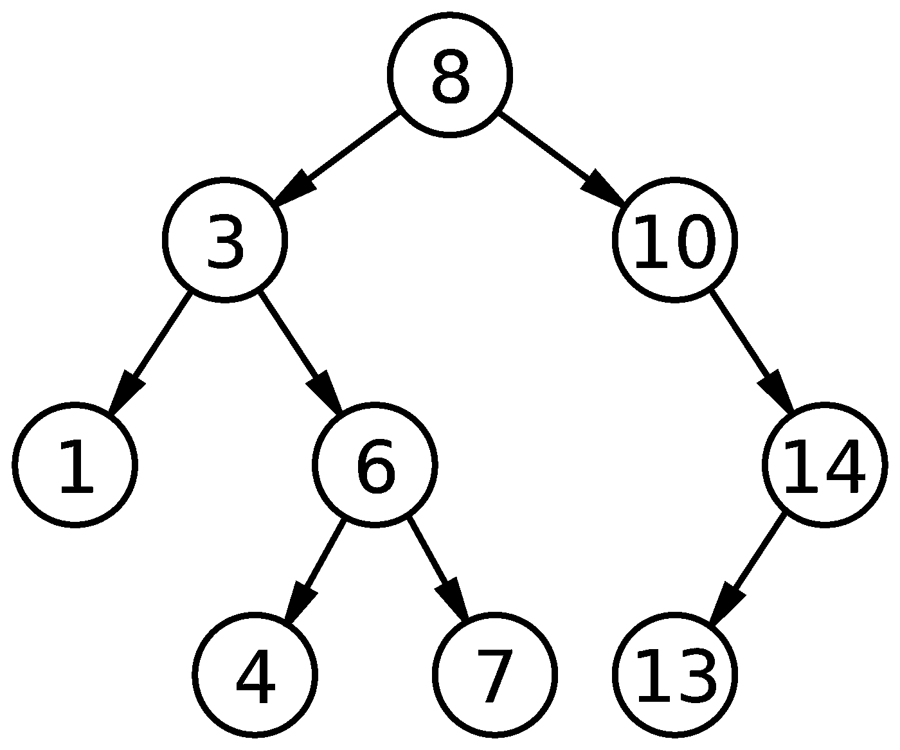

# 您可能不需要 JavaScript 中的递归函数

> 原文：<https://medium.com/hackernoon/you-might-not-need-that-recursive-function-in-javascript-275651522185>


**编辑:**我收到了相当多的反馈，他们将这篇文章解读为递归函数不好，迭代方法总是更好。这与我的想法相去甚远——本文的目的只是讨论迭代作为一种替代工具！

在编程中，我们经常会遇到这样的情况，答案似乎需要解决同一个问题不确定的次数。当我们遇到这样的问题时，我们倾向于使用递归——通常是通过创建一个函数，根据需要多次调用自己来实现的。递归在程序设计中非常重要，许多问题只能用它来解决。也就是说，递归可能会更慢，填满调用堆栈，并且在概念上更复杂。

在这篇文章中，我将探讨一个问题的例子，这个问题看似适合递归解决，但实际上可以通过理解 JavaScript 对象引用来更有效地解决。这个帖子例子的动机来自于我改编的一个优秀的 [StackOverflow 答案](https://stackoverflow.com/a/18018037/6525724)。

如果你喜欢这篇文章，请为它鼓掌👏(还是 50！)来帮助传播消息！

***

## 通过注册我的免费时事通讯，在您的收件箱中获得快速 JavaScript 技巧！

***

# 问题是

在这个问题中，我们试图建立一个基于对象平面阵列的分层对象树结构。我们事先不知道树有多深，但是我们知道每个节点只能有一个父节点，并且可以有任意数量的子节点。我们可以使用的示例树的可视化如下:



Example Tree Structure

如前所述，我们接收到的构建这个树示例的数据是一个扁平的数组，格式如下。每个元素代表树中的一个节点，并且只能是一个父节点的子节点。节点 8 没有父节点，所以我们可以在下面的数组中看到，`id` 8 的对象有一个等于`null`的`parentId`。

```
const flat = [
  { id: 1, parentId: 3 },
  { id: 3, parentId: 8 },
  { id: 4, parentId: 6 },
  { id: 6, parentId: 3 },
  { id: 7, parentId: 6 },
  { id: 8, parentId: null },
  { id: 10, parentId: 8 }, 
  { id: 13, parentId: 14 },
  { id: 14, parentId: 10 }
]
```

我们需要将这个平面数组重新排列成的最终结构如下:

```
[
  { 
    id: 8,
    children: [
      { 
        id: 3, 
        children: [
          { 
            id: 1, 
            children: [] 
          }, 
          { 
            id: 6, 
            children: [ 
              { id: 4, children: [] }, 
              { id: 7, children: [] } 
            ]
          }
        ] 
      },
      { 
        id: 10, 
        children: [ 
          { 
            id: 14, 
            children: [
              { id: 13, children: [] }
            ] 
          }
        ]
      }
    ]
  }
]
```

# 解决方案

在这种情况下，您首先想到的可能是递归:我们得到了一棵长度不确定的树。我们设想可能需要创建一个函数来填充节点的子节点。然后，我们递归调用该函数，直到树被完全填充(即，不再找到子节点)。

虽然这可能行得通，但还有更好的方法！

我们可以简单地遍历数组，并将每个对象分配给其父对象的`children`数组。这可能没有直观意义，但请考虑以下逻辑:

*   对象`3`被分配给对象`8`的`children`数组
*   对象`6`被分配给对象`3`的`children`数组
*   分配给对象`8`的`children`数组的对象`3`实际上只是内存中对象`3`的**引用**…意味着它的`children`数组将有对象`6`引用。

这个逻辑扩展到整个数组，这意味着我们只需要遍历一次数组就可以构建出我们的树！

以下是基于这一思想的潜在非递归解决方案:

非常简单，我们只遍历数组一次！

我想做一个额外的优化:我们每次在循环中使用的`findIndex`函数对于小示例树来说没什么大不了的，但是如果我们处理一棵大树，这实际上会变得很昂贵。让我们创建一个对象来缓存找到的父位置。

成功！我们已经完成了树的构建，而没有实现递归函数。