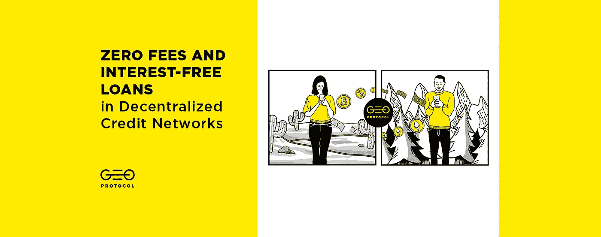
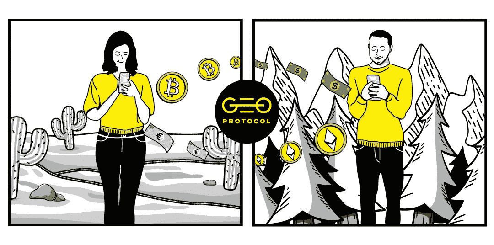

# 分散信贷网络中的零费用和无息贷款

> 原文：<https://medium.com/hackernoon/zero-fees-and-interest-free-loans-in-decentralized-credit-networks-7dc9e2b5b42d>

[区块链](https://hackernoon.com/tagged/blockchain) [技术](https://hackernoon.com/tagged/technology)发展非常迅速，正在改变许多行业。在许多领域，去中心化被认为是增加交易透明度和简化交易的有效方法。特别是，权力下放的应用在金融方面显示了巨大的潜力。区块链可以颠覆传统银行业，实现新的商业模式，并使传统的金融基础设施更加高效。一些人甚至认为，区块链技术可以用即将到来的分散化金融系统取代传统银行业务，在这种系统中，用户将能够利用不受审查的金融服务，存储和转移他们的资产和资金，无需中间中央机构就可以获得贷款，并完全控制他们的财富和个人数据。

许多这种新的基础设施目前正在建设中，从根本上改变了人们做生意和花钱的方式。分散式金融网络基于智能合约和点对点(P2P)服务，取代银行成为可信方。他们可以让用户使用复杂的金融工具来创造和保护他们的资产和管理风险。这样的系统有潜力通过提供实时交易、无处不在和公平来完全重塑金融世界。

金融领域中显示出巨大的权力下放潜力的一个领域是货币借贷，这是任何正常运行的经济的核心原则。基于区块链的分散式贷款仅在过去 5 年才成为可能。分散式信贷网络最近迅速普及，通过在平台上直接连接借款人和贷款人，有望为企业和公众提供便捷的全球信贷服务。分散的借据信用网络的用户甚至可以利用*的无息贷款和零费用*。

# 什么是分散借贷？

P2P 贷款并不是一个新概念。在银行兴起之前，这是过去处理贷款和后续付款的方式。这一系统基于人际信任，但随着时间的推移，P2P 贷款被传统的银行贷款所取代，银行充当中介并提供额外的保护。不幸的是，这种保护伴随着高昂的费用、借贷法规的复杂性以及缓慢的处理时间。

2008-2009 年全球金融危机主要是由银行人为制造的有毒债务池造成的，危机过后，金融体系的混乱和脆弱引起了监管机构和企业对商业银行的不满，导致试图建立一个更透明的金融体系。引入了新的法律和条例，以提高透明度和使筹资过程民主化。他们向新的贷款机构敞开了大门，其中许多都是以流行的 P2P 模式运作的，这种模式没有银行的官僚作风。其结果是点对点(P2P)平台的兴起，这种平台直接连接投资者和借款者，是一种新型的“[共享经济](https://en.wikipedia.org/wiki/Sharing_economy)”。

P2P 平台消除了过程中的中间人，并使用技术来确定信誉和与借款人适当偿还债务的能力相关的其他因素。它们为借贷双方提供了更高的透明度、简化的程序和更好的利率交易。P2P 模式已经被证明是成功的，根据[统计](https://www.statista.com/)，全球 P2P 贷款市场有望在不久的将来达到 1 万亿美元。

# 基于区块链的去中心化信用网络的优势和挑战

银行家可能会告诉你，传统的金融体系是全球化的、高效的，每天流动着数万亿美元，服务着数十亿人。事实上，银行贷款可以让企业获得资本，从而推动经济增长。但现代金融体系充满了问题，为欺诈和犯罪提供了机会，并增加了消费者最终必须支付的成本。

为什么传统金融体系效率如此之低？它基于无效的工业技术和造纸工艺。由于是集中式的，它很难改变，容易受到恶意软件攻击和系统故障的影响。它是排外的，所以数十亿人被剥夺了使用基本金融工具的权利。今天的金融系统通过数量有限的强大中介机构运作，这些中介机构通过提供可以轻松委托给软件的服务来赚钱。

# 进入区块链

区块链技术是金融业真正的游戏规则改变者。区块链建立在分布式账本上，运行在数百万台设备上，因此它在设计上是去中心化的。它使金钱、债券、股票和几乎所有其他种类的资产的所有权从一个人安全、秘密地转移到另一个人成为可能，而不需要中介，因为信任不是由政府和银行建立的，而是由网络共识协议、密码术、代码和协作建立的。
总部设在区块链的金融服务使其优于中央集权的同行的主要特征是:

*   *无许可*:任何人都可以使用互联网访问分散的金融网络，任何人都不能因其身份、居住地和收入水平而被拒绝服务。
*   *不可信*:人们不必依赖一个中心方来保证交易的有效性。
*   *抵制审查*:在以后的某个时间点，没有一个中心方可以认为已验证的交易无效。
*   *可编程:*使用即插即用架构，可以低成本创建金融服务。
*   *透明*:公共区块链完全透明。

# 区块链上的分散贷款

传统贷款仅限于正规银行经营的地区。这种模式是不公平的，因为现在生活在贫穷国家的 20 多亿人无法获得融资，因为他们通常没有官方身份证明，也没有银行账户。正规银行的许多贷款协议在设计上是不透明的，包含隐藏的费用和罚款率。

分散的信贷网络使人们无需去银行就能获得贷款，贷款也不局限于本地市场。区块链的分散式贷款解决方案基于永恒的点对点模式，使整个过程无缝衔接。它们提供了一种更便宜、更安全的个人贷款方式，让人们能够平等地进入全球贷款市场。它们尤其为普通消费者和中小企业提供了巨大的好处，这些人往往难以从正规银行获得信贷。在一个分散的信贷网络中，如果有一台设备可以接入互联网，每个人都可以获得贷款。

没有中间人。消费者和企业可以提交贷款请求，并直接与来自世界各地的愿意提供贷款的贷款人联系，这些贷款人反过来会出价提供贷款。因此，借款人可以获得极具竞争力的融资。区块链分散信贷网络的利率由参与者商定。所有国家的人都有同样的机会获得贷款和有竞争力的利率。

智能合同充当贷款协议，包含有关参与方、信誉、资本、抵押品以及违约原因的数据。通过设计安全的智能合同，贷方可以很容易地评估对方的可信度并审查借款人。贷款人还可以验证交易，并几乎随时执行与贷款流程相关的其他日常管理任务，从而降低成本并加快流程。

所有关于交易的信息都是公开的，可以对每个地址进行信用评级。任何人都可以看到特定地址的交易细节并进行分析。如果贷款提供者注意到一些可疑或不寻常的活动，他们可以简单地停止提供贷款。

分散式贷款仍处于起步阶段，只有时间才能证明它是否会成为一个全球体系，让所有人都能平等地进入全球贷款市场。有一些挑战可能会使其难以广泛采用。它们涉及确定信誉、建立和核实身份、了解你的客户(KYC)规则。

收取区块链的贷款可能并不容易，这将考验智能合同的合法性。这将要求在全球层面上对 P2P 跨境贷款采用一个监管框架。目前，法院不太可能承认智能合同在做生意中的有效性。虽然交易记录存储在分布式分类账中，但没有评估和管理风险的程序。在这个阶段，区块链似乎不适合复杂的金融业务。但这并没有阻止企业家采用区块链技术来执行更简单的任务，因此有很多项目在区块链平台上运行，如 SALT、Ripio Credit Network、ETHLend，其中一些有增长的潜力。

# IOU 信用网络

近年来，我们见证了一个结合了信用和社会信任的借据信用网络的成长。该模型基于无权限用户之间的可传递信任或信用。首先，用户表达信任，并战略性地决定他们愿意向对方提供多少信用。彼此不直接信任的用户可以通过在网络中沿着信任链交换借条来提供交易。今天，IOU 信用网络是 Ripple 和 Stellar 的真实世界支付系统的主干，世界各地的不同银行也部署了这些系统。

# 涟漪

Ripple 是最受欢迎的分散式金融系统之一，作为一种快速、低成本的方法，用于以现有法定货币、Ripple 自己的加密货币 XRP 以及其他加密货币进行支付。它使世界各地的人们能够几乎实时地交换货币、商品和其他资产，平均来说，这个过程需要 5 到 10 秒钟。网络维护分布式分类帐，该分类帐存储系统中所有账户的信息。它创建了一个信用/借记网络，其工作方式类似于传统的银行系统。Ripple 用户可以购买商品或将钱存入另一个用户，例如一个*网关*——一个现有的银行或一个在线平台，系统会跟踪每对用户的余额。交易的验证由*验证者*——组织和个人的特殊服务器进行。

xrp 是 Ripple 预先挖掘的，用户可以在系统内开户后购买。该系统为每笔交易收取少量 XRP 费用，并在交易确认后销毁该费用。XRP 支付很简单，不需要收到货币的用户的任何合作。但是想要收到欠条付款的用户必须与其他用户建立信任关系，并声明对每个用户的信任程度。用户需要指定每种货币的信任度。

# 主要的

Stellar 充当连接支付系统、银行和个人的国际交易的廉价中介。这种去中心化的金融服务平台最初是一个 Ripple fork，但现在它是一个独立的平台，基于 Stellar Consensus 协议工作，并拥有其名为 Lumens (XLM)的本地资产。Stellar 是一家非营利组织，因此它不向用户收取网络接入费，但它已经收到了来自支持者的初始资金和捐款。

Stellar 支持多币种交易。该网络使跨境汇款变得容易，因为交易几乎是瞬间完成的(从 3 秒到 5 秒),并使用锚在 Stellar 网络上发布资产。锚可以持有存款和发行信用，并作为不同货币和恒星网络之间的网关。当人们把钱存入他们在恒星网络上的主播的在线账户时，这些存款被记录为他们账户中的信用。之后，人们可以发送付款，并从其他用户那里接收付款。所有的货币交易都是由锚通过信用额度发行的。用户为每笔交易支付 0.00001 流明的相对较低的费用。所有的交易费用都被转移到一个费用池中，并通过“通胀投票”在用户之间进行分配。

# 无声的低语

SilentWhispers 是由 Moreno-Sanchez 等人提出的一种分散的基于路径的交易网络，没有公共分类帐。该网络是隐私保护的，因为它不需要分类帐来保护交易的完整性。SilentWhispers 网络是作为 C++库实现的。网络使用户之间能够进行交易，并保证他们的隐私。它使用一种新的分布式支付协议来计算发送方和接收方之间的可用信用，并且不会透露任何有关信用的信息。实验表明，交易可以在大约 1.3 秒内完成。研究人员认为它可以部署在现实世界中，因为它的效率和可扩展性足以应对不断增长的用户和货币交易。

# [地理协议](https://www.geoprotocol.io/)

GEO 开发了一个用于相互信任的分散 P2P 价值交换网络的协议。GEO 协议的独特之处在于，它不基于公共分类账，并且是*区块链不可知的*。这使得它能够连接各种区块链以及非区块链的资产。事务仅通过参与节点的本地链外共识来执行。所有数据都由安装了复合通道(状态通道和信任线的组合)的节点存储。

GEO node 非常轻便，甚至可以在普通的智能手机上安装和运行，使其成为个人金融中心。在 GEO 网络中进行交易不收取网络费用。

由于其灵活的基础设施，GEO 协议可以用作现有区块链系统的高效无信任支付网络层，并通过分布式信任网络简化法定货币支付。这使得能够在 GEO 网络参与者之间创建事实上分散的信贷网络。

默认情况下，网络中的贷款是免费的(只要特定的参与者相互信任，就像你向你的朋友提供小额贷款一样)。但是 GEO 协议也允许创建第三方 dApps，在那里可以实现任何功能，包括创建商业动机的分散信用网络。

# 结论

P2P 贷款是一种由来已久的做法，传统上与高风险和极端的地方性联系在一起。如今，P2P 模式正在成功地实现数字化和异地化，不可变账簿和智能合约等区块链技术在现有 P2P 借贷模式的基础上建立了额外的信任和透明度。区块链的分散式信贷网络通过将个人借款人和企业与有意愿的贷款人直接联系起来，确保他们能够在全球范围内获得利率具有竞争力的贷款。

## 遵循 GEO 协议:

【[传媒](https://medium.com/geoprotocol/) | [推特](https://twitter.com/geo_protocol)|[GitHub](https://github.com/geo-protocol)|[Gitter](https://gitter.im/GEO_Protocol/)|[电报](https://t.me/geocommunity)|[LinkedIn](https://www.linkedin.com/company/geoprotocol/)|[YouTube](https://www.youtube.com/channel/UC3jEvQvZAmCUXa7dCoX9_Lg/)