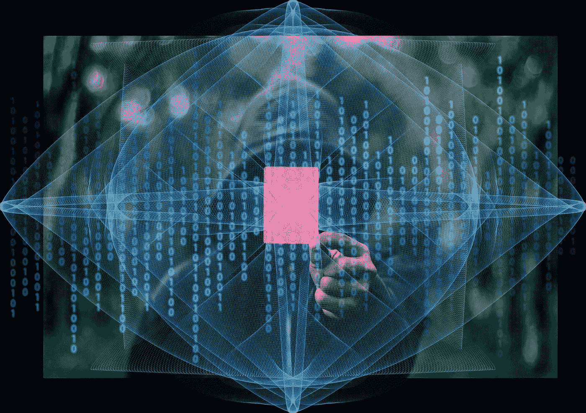
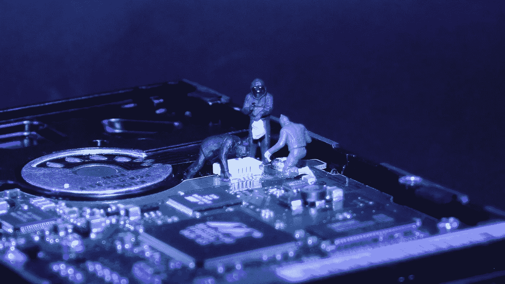

# 零信任浏览减轻网络安全工作疲劳？

> 原文：<https://medium.com/hackernoon/zero-trust-browsing-to-reduce-cybersecurity-job-fatigue-7ce72a633d4>

Illustration by [Geralt](https://pixabay.com/users/geralt-9301/)

最近的一份 ESG(企业战略集团)报告强调了困扰信息安全专业人员的一个鲜为人知的普遍问题——工作疲劳。最近的 ESG/ISSA(信息系统安全协会)调查强调了人力成本:

68%的网络安全专业人士认为，网络安全职业可能会影响个人生活和职业生活之间的平衡。
62%的网络安全专业人士认为他们的组织没有为他们提供足够的培训来应对业务和 IT 风险。
41%的网络安全专业人士表示，网络安全技能短缺导致 infosec 员工花费过多时间处理高优先级问题和事件响应。
38%的网络安全专业人士表示，网络安全技能短缺导致了高倦怠率和员工流失。

这是全球员工危机和日益危险的威胁环境共同作用的直接结果，正如一项 [(ICS)2 研究](https://www.isc2.org/-/media/ISC2/Research/2018-ISC2-Cybersecurity-Workforce-Study.ashx?la=en&hash=4E09681D0FB51698D9BA6BF13EEABFA48BD17DB0)所强调的那样，该研究警告称，合格的网络安全人员短缺 300 万。

恶意行为者即将把人工智能和机器学习纳入他们的利用模型，并利用它们开发基于群体的僵尸网络，旨在压倒传统防御。随着零日漏洞和利用的激增，反应措施将越来越不足，有经验的网络安全人员的工作量将增加，导致更高的倦怠和流失率。

如果不从被动防御战术大幅转变为主动防御战术，即便是人员配备非常理想的网络安全团队也将不堪重负。他们已经面临职业风险，如长时间工作、高压力水平和职业挫折，这些都可能导致疲惫、倦怠甚至心理健康问题。

理想的网络预防解决方案应该为各种基于网络的不可执行内容、各种持续使用的攻击媒介(如电子邮件、web、应用程序和云文件共享应用程序)以及连接到互联网的每台设备提供即时的端到端安全保护。它应该允许零信任浏览，对威胁数据库、防病毒软件、防火墙和其他现有经典防御基础设施的依赖最小。由于当今的绝大多数威胁都是浏览器带来的，因此当前最好的主动防御方法是浏览器隔离。

浏览器隔离可以是本地的，也可以是远程的。

本地隔离解决方案使用设备本身的虚拟化将浏览与其他功能分开。例如，可以通过本地虚拟机(VM)实现端点隔离。虚拟机是安装在软件上的操作系统或应用程序环境，它模仿专用硬件并运行在用户的设备上，但有以下缺点:
高 CPU 和内存请求导致用户体验缓慢
对于大型组织来说，成本高得令人望而却步，因为每个端点都必须单独配备一台虚拟机:
可能需要升级部分或全部设备以适应增加的 CPU 和内存请求
增加 IT 人员的工作负载
限制 BYOD 选项，因为它位于设备本身上

在远程方面，过去十年出现了虚拟桌面基础架构(VDI)，这是一种虚拟化技术，可在数据中心的集中式服务器上托管桌面操作系统。桌面映像通过网络传送到终端设备，使用户能够与操作系统及其应用程序进行交互，就像它们在本地运行一样。VDI 面临着三重障碍
高成本:除了运行 VDI 基础架构的成本之外，由于需要为物理和虚拟桌面获取许可证，它还会导致双重成本
受损的用户体验:必须通过专用客户端访问远程桌面，从而导致延迟增加
对策略的需求:由于 VDI 本身不是一个安全解决方案，组织仍需要实施和管理策略，如 web 应用程序访问。

但是今天，对于正在寻找一种可承受的针对浏览器携带的威胁的整体防御的组织来说，最接近的方法是基于容器的远程浏览器隔离(RBI)。根据 Gartner“到 2022 年，隔离高风险互联网浏览和电子邮件中 URL 访问的组织将减少 70%危及最终用户系统的攻击。”

Illustration by [Wir Sind Klein](https://pixabay.com/users/wir_sind_klein-6630807/)

由于 RBI 不需要安装单独的端点，因此可以以最小的负担实现组织范围的部署。除了攻击渗透率的大幅下降以及由此导致的需要审查和解决的安全警报的下降，它还能非常有效地减少网络安全团队的工作量，改善他们的工作/生活平衡，并减少工作疲劳和倦怠。更好的是，由于它不依赖于设备并且不受浏览器限制，RBI 可以跨包括手机和平板电脑在内的设备部署，从而消除了 BYOD 限制或增加了安装成本。

由核电站和军事设施开创的 RBI 解决方案依赖于端点和实际浏览之间的物理分离。所有可执行代码都在远程浏览器上执行，并呈现为发送到用户本地浏览器的安全内容流，从而将恶意代码锁定在端点之外。

这使得下载的文件成为威胁渗透的唯一潜在来源，这需要在将它们传送到终端之前对它们进行沙箱保护。

人工智能辅助威胁开发的能力预计会增加，这意味着依赖威胁检测来消除威胁的传统沙盒技术可能会越来越无效。选择基于非检测的机制(如内容解除和重建(CDR)技术)来净化下载的文件是当今最接近零信任浏览的方式。CDR 解构所有传入的文件，删除任何与文件的类型结构规范不匹配的元素，并重建文件，同时保留其全部功能。

借助集成的 RBI/CDR，最终用户的浏览体验与直接浏览几乎相同，并且可以从任何设备上执行，消除了与远程工作相关的任何限制。

RBI 的民用仍处于起步阶段，目前只有 4 家 RBI 解决方案提供商，它们都是成熟的国际知名企业:

[Menlo](https://www.menlosecurity.com/) 凭借其安全隔离平台(于 2016 年 10 月首次发布)，接近完全隔离，但仍融入了一些预先存在的 DOM 技术元素，并使用 PDF viewer 而不是 CDR，减少了接近原生的浏览体验
[Ericom](http://www.antionline.com/ https://hackforums.net Question to Ericom: following registration, it appears hackforums.net is a forum for black hat hackers. Would you recommend not posting there? https://hackercombat.com – issues with registration, confirmation email not received https://cybersecurityforum.com/cyber-resources/discussion-group/ After registration, it appears it has little activity. Can be used for long shelf-life post but only occasionally.)，凭借 Ericom Shield(于 2017 年 9 月首次发布)，提供了一个集成 CDR 的全面服务、可模块化的 RBI 解决方案，并支持与现有安全基础设施的轻松集成
[赛门铁克](https://www.symantec.com/)， 通过 Web 隔离(2018 年 2 月首次发布)，几乎提供了完全的隔离，但仍然支持直接视频流，这是一个潜在的漏洞
[Citrix](https://www.citrix.com/)，其安全 Web 网关(2018 年 3 月首次发布)，依赖于 ICA (Citrix 协议)，因此还不是一个专用的浏览解决方案，并且仍然缺乏用于可执行文件下载的完整 CDR

从减少网络安全人员的工作量到将最终用户从繁琐的浏览限制中解放出来，RBI 的潜力不仅仅是提供先进的网络安全。任何有远见的 CISO 都应该明确考虑将 RBI 作为其网络安全战略的基本要素，或者至少彻底评估其潜在利益。

热情邀请所有对浏览器隔离感兴趣的人加入新创建的[浏览器 _ 隔离](https://www.reddit.com/r/Browser_Isolation/)子编辑

如果你喜欢这篇文章，请尽情鼓掌，并与你可能感兴趣的朋友分享。谢谢